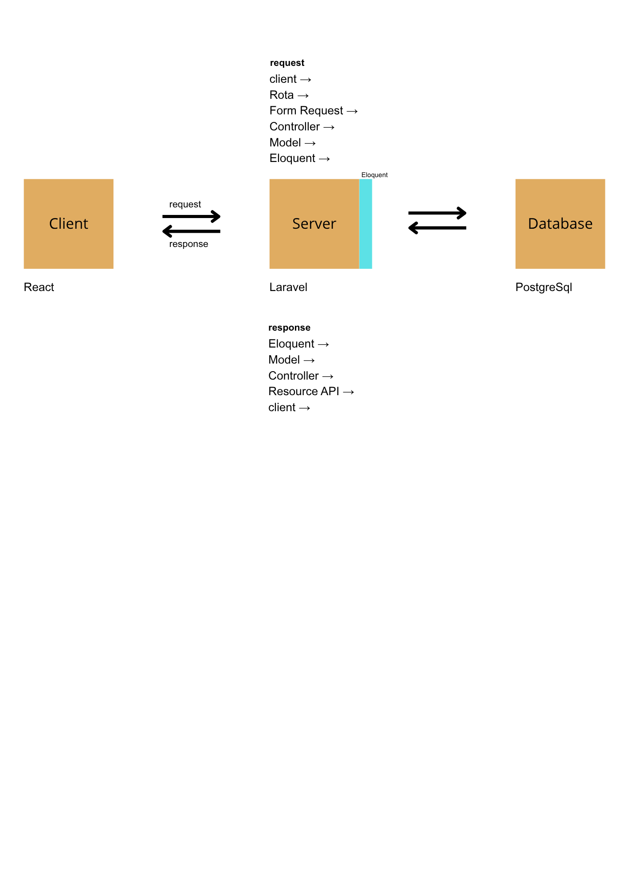

Este projeto é a solução para o Desafio Técnico do V-Lab. Trata-se de um app para registrar e acompanhar solicitações de atendimento, onde podemos criar, consultar, filtrar e atualizar o status, com foco em boas práticas e separação de responsabilidades.

Tecnologias Utilizadas

    Frontend:
       React 19.2.8
       TypeScript 6.0.2
       Vitest 5.0.1 (Testes)

    Backend:
    PHP 8.5.0
    Laravel 13.32.0
    Knuckleswtf/Scribe 5.11.0 (Documentação OpenAPI)

    Infraestrutura & Banco de Dados:
    PostgreSQL 16
    Docker 29.8.0 & Docker Compose

-----Como Executar o Projeto-----

O projeto foi configurado para subir integrado utilizando o Docker Compose.

    Navegue até o diretório raiz do projeto (`/vlab`).
    (Opcional) Verifique se as portas `8000` (API) e a porta do frontend estão livres na sua máquina.
    Execute o comando para construir e subir os containers:
    docker-compose up --build

    Caso ocorra problema de permissão no Linux, utilize
    
    sudo docker-compose up --build

Documentação da API (OpenAPI)
    A documentação interativa da API foi gerada utilizando o Scribe.

    Acesso via Navegador: Com os containers rodando, acesse http://localhost:8000/docs

    Especificação OpenAPI: O arquivo gerado encontra-se no git dno repositório em: server/storage/app/private/scribe/openapi.yaml.

    Nota: Para atualizar a documentação durante o desenvolvimento, o comando deve ser executado dentro do container da API:
        sudo docker exec -it vlab_api php artisan scribe:generate

Como Rodar os Testes
    Com os containers em execução, abra um novo terminal e execute:

        Testes do Frontend (React/Vitest):

            sudo docker exec -it vlab_client npm run test

        Testes do Backend (Laravel/Pest/PHPUnit):

            sudo docker exec -it vlab_api php artisan test

Decisões Arquiteturais
    A aplicação foi desenhada com base em uma arquitetura Em monolito (do lado da API), utilizando o padrão MVC adaptado para o fluxo REST:

    Validação de Entrada (Form Requests): Toda requisição passa por uma camada estrita de validação antes de bater no Controller. Os erros 422 retornados aqui são interceptados e mapeados nos inputs do frontend.

    Orquestração (Controllers): Atuam apenas como orquestradores magros, recebendo os dados já validados e repassando ao Model.

    Regras de Negócio (Models e Exceções): As lógicas de condição (como ser obrigado a ter ustificativa para prioridade urgente) e a máquina de transição de status residem no Model. Quebras de regra disparam uma exceção customizada (RegraNegocioException), que o Laravel intercepta a fim de padronizar as respostas de erro HTTP 400.

    Contratos de Saída (Resources): A formatação dos dados que a API devolve ao React (View) é centralizada nos Resources, garantindo que o frontend receba uma estrutura JSON previsível.

    Fluxo da Requisição:
    Client (React) -> Rota -> Form Request (Validação) -> Controller -> Model (Regra de Negócio) -> Controller -> Resource (Contrato de Saída) -> Client (React)

Uso de Inteligência Artificial
    Conforme as regras do desafio, ferramentas de IA generativa (Gemini PRO, fornecida pela conta Google do CIn) foram utilizadas como apoio sob supervisão estrita, nas seguintes áreas:

    Pedagógica e Ecossistema: Ajudar na compreensão do fluxo do Laravel (Active Record, Eloquent, ciclo de vida das requisições) e na sintaxe de comandos do Artisan.

    Debug e Refatoração: Auxílio na estruturação dos testes automatizados (resolvendo problemas de asserção de código).

    Frontend (Geração Assistida): Geração de blocos de marcação JSX e CSS básicos no frontend. Toda a lógica de estado, chamadas de API, componentização e a integração dos erros de validação (validationErrors) foram auditadas e desenhadas manualmente, priorizando a organização humana do código em detrimento da verbosidade gerada por IAs.

    Atenção: NÃO FOI UTILIZADO TECNOLOGIA DE AGENTES DE IA.